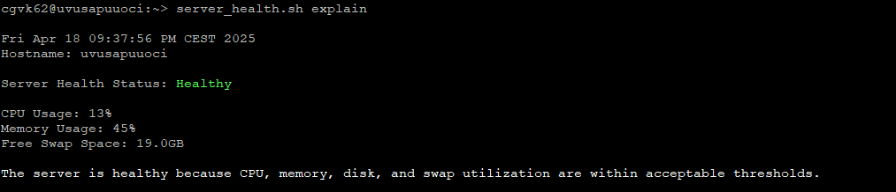

# Server Health Check Script

This Bash script performs a basic health check on a Linux server by evaluating CPU usage, memory usage, disk utilization, and swap space availability. The script outputs a summarized health status along with optional explanations when thresholds are exceeded.

## 🛠️ Features

- Calculates **CPU utilization** using the `top` command.
- Calculates **memory utilization** using the `free` command.
- Evaluates **disk usage** across all mounted file systems (excluding `/sap_staging`).
- Checks **available swap space** and alerts if it’s below the minimum threshold.
- Provides a clear **"Healthy"** or **"Not Healthy"** server status.
- Optional detailed explanation of what caused a non-healthy state.

## 📋 Thresholds Used

| Metric            | Threshold   | Description                                       |
|------------------|-------------|---------------------------------------------------|
| CPU Utilization   | > 60%       | Considered high CPU usage                         |
| Memory Utilization| > 80%       | Considered high memory usage                      |
| Disk Utilization  | > 85%       | High disk usage except for `/sap_staging` mount   |
| Swap Space        | < 2 GB      | Considered low swap availability                  |

## 🖥️ Example Output

```bash
$ ./health_check.sh

Sat Apr 19 12:30:00 UTC 2025
Hostname: my-server

Server Health Status: Healthy

CPU Usage: 25%
Memory Usage: 45%
Free Swap Space: 3GB

